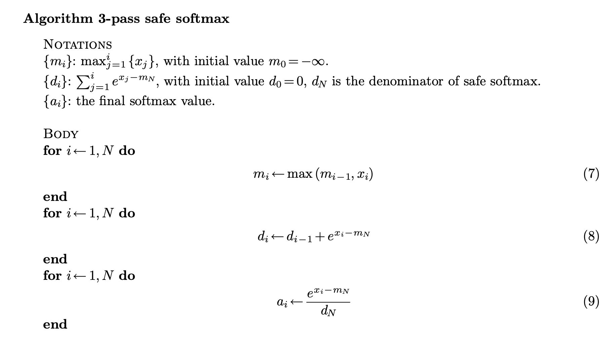
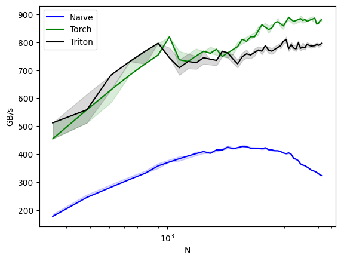

# Softmax 

The softmax kernel is the heart of the attention mechanism in neural networks. It transforms logits (raw model outputs) into probabilities by exponentiating and normalizing them. Its formula is:
$$$
\text{softmax}(x_i) = \frac{e^{x_i}}{\sum_{j} e^{x_j}}
$$$

There are three kinds of softmax kernel:
- 3-pass safe kernel
- 2-pass online kernel
- 1-pass specialization for flashattention

Let's follow the artiles below to learn softmax 3-pass and 2-pass kernel:
> https://courses.cs.washington.edu/courses/cse599m/23sp/notes/flashattn.pdf
> https://zhuanlan.zhihu.com/p/668888063

## 3-pass kernel

## 2-pass

# Experiments

## Triton

### RTX4090

